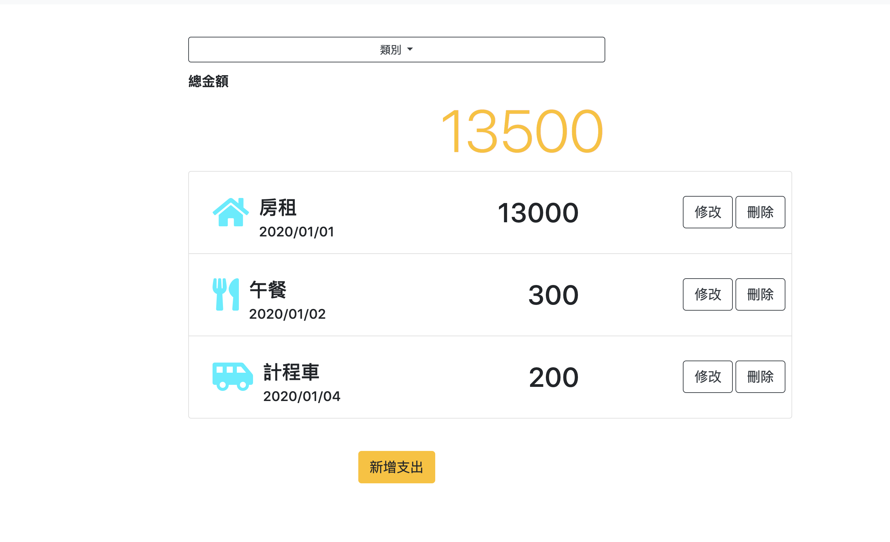

## Project Title：
美食餐廳網，在這裡可以找到想要的餐廳、瀏覽詳細資訊與新增編輯刪除資料。
## Installing：
1. 打開你的 terminal，Clone 此專案至本機電腦
> git clone https://github.com/good800322/expense-tracker
2. 開啟終端機(Terminal)，進入存放此專案的資料夾
> cd expense-tracker
3. 安裝 npm 套件
> 在 Terminal 輸入 npm install 指令
4. 載入seeds
> cd models/seeds  後 node seeder.js
5. 啟動伺服器，執行 app.js 檔案
> 在 Terminal 輸入 npm run dev 指令 
6. 登入FB網站取得API Key，在檔案中新增.env
> FACEBOOK_ID=xxxxxxxx
> FACEBOOK_SECRET=xxxxxxxx
> FACEBOOK_CALLBACK=http://localhost:3000/auth/facebook/callback
## Features：
1. 使用者可創建帳號或使用facebook登入
2. 使用者可以在登入後管理與瀏覽自己的支出
3. 使用者可以瀏覽全部消費，顯示消費的項目、金額、種類與日期。
4. 使用者可以編輯現有之消費資料。
5. 使用者可以新增一筆消費資料。
6. 使用者可以刪除已存在之餐廳資料。
7. 使用者可以根據、種類來瀏覽資料。
## 預設使用者：
| email              |  password | 
|--------------------|-----------|
|  user1@example.com |  12345678 |
| user2@example.com  |  12345678 |